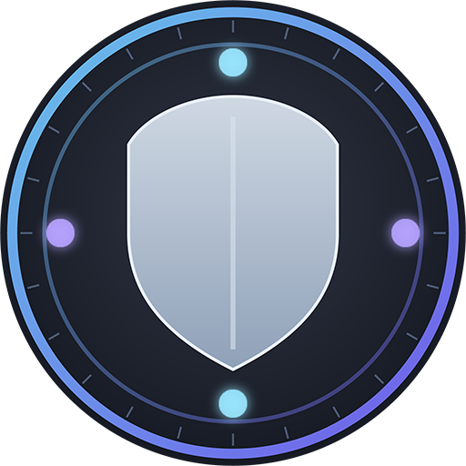

#  Fellowship Overlay  
*A quality-of-life companion for the game **Fellowship***  

> **Track Meiko’s defensive buffs and Shadow Lord’s orbs easily — no more lost uptime in the chaos.**

---

## 🧭 Overview

**Fellowship Overlay** is a lightweight Windows app that enhances your gameplay experience by showing **clear, configurable overlays** for the buffs that actually matter.

The current version focuses entirely on:
- **Meiko’s defensive buffs** — often buried in a sea of icons during combat.
- **Shadow Lord’s orbs** — seamlessly integrated into the overlay for instant awareness.

This tool sits quietly on top of your game window, updating automatically from the *Fellowship* combat log.

---

## ⚠️ Important: Not Real-Time

Because *Fellowship* does **not expose live buff data to third-party tools**, the overlay must rely on **combat log parsing**.  
This means events appear with a **natural delay of 1–3 seconds** — that’s how long the game itself takes to flush new log entries to disk.

> 🔸 The overlay is as “live” as the combat log allows.  
> 🔸 This limitation is **intentional and compliant** with the game’s **Terms of Service** — no memory reading, no injection, no network sniffing.  
> 🔸 If the game developer ever provides an API, live tracking will be implemented immediately.

---

## ⚙️ Setup Requirements

1. Windows 10 or 11  
2. [.NET 8 Desktop Runtime](https://dotnet.microsoft.com/en-us/download/dotnet/8.0)  
3. Read access to your *Fellowship* combat-log directory (**SteamLibrary\steamapps\common\Fellowship\fellowship\Saved\CombatLogs**)
4. **Advanced Combat Logging must be enabled** in the game’s settings
   - In *Fellowship*, open **Settings → Gameplay → Combat → Enable Advanced Combat Logging**
   - Without this option, the overlay will not detect buff events properly.

---

## 🚀 Quick Start

1. **Download** the latest release from the [Releases](../../releases) page.  
2. **Extract** the `.zip` anywhere (portable, no installation needed).  
3. **Launch** `Fellowship Overlay.exe`.  
4. On first run, choose your *combat log folder* and enter your character name.  
5. Position and lock the overlay where you want it.  
6. Start your game — watch your buffs and orbs update automatically.

---

## ✨ Features

- 🛡️ **Real-time(ish) buff tracking** — visualises Meiko’s defensive buffs with timers and status rings.  
- 💠 **Shadow Lord orb tracker** — displays orb count and phase timing.  
- ⚙️ **Configurable overlays** — resize, move, and lock anywhere on your screen.  
- 🧩 **Presets** — ready-to-use setups for Meiko’s tanking toolkit.  
- 👁️ **Click-through mode** — keep overlays visible but non-interactive.  

---

## 🧩 Customisation

- **Layout:** Choose between icon-only or detailed list mode.  
- **Size & Opacity:** Fit the overlay cleanly into your UI.  
- **Position:** Drag freely; lock it again before combat.  
- **Presets:** Instantly load recommended buff sets for Meiko.  

More roles, classes, and buff packs will follow later.

---

## 🧠 Design Philosophy

The overlay’s purpose is simple:  
**Reduce noise, increase clarity.**

It doesn’t hack the client or interfere with the game — it just reads what *Fellowship* already writes to disk and makes that information usable.  
It’s a pure quality-of-life enhancement for players who want to perform better without staring at a cluttered buff bar.

> *Less clutter. More control.*

---

## 🖼️ Icon Concept

The icon is inspired by the official *Fellowship* emblem — a circular crest — combined with a subtle **shield-and-orb overlay** motif.  
It symbolises protection and clarity, echoing Meiko’s defensive nature.  
Colours: **dark steel with faint teal/blue highlights**, glowing slightly when buffs are active.

---

## 💬 Support & Contribution

If you enjoy this tool or want to support development:  
☕ **[Buy Me a Coffee](https://buymeacoffee.com/trineon89)**  

Questions, bug reports, or collaboration offers:  
💬 **Discord:** `trineon89`

---

## 🧑‍💻 Contributing Code

Pull requests are welcome for:
- New buff presets or class support  
- UI / UX improvements  
- Bug fixes  

If you wish to modify or reuse code **outside of a pull request**, please contact **@trineon89** first.  
The source is open for learning and improvement — but derivative distributions require prior permission.

---

## 📜 License

This project is provided **for personal and non-commercial use**.  
You may:
- View, fork, and build it for personal use.  
- Submit changes via pull request.

You may **not**:
- Redistribute modified versions publicly without prior written consent from `trineon89`.  
- Use it commercially or bundle it in third-party launchers.

By cloning or using this repository, you agree to respect these terms.

---

> Fellowship Overlay — *bringing clarity to chaos.*
